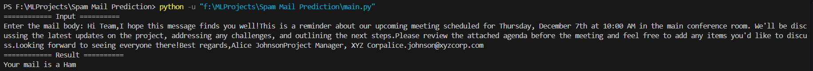

# **
Spam Mail Prediction
**

### **About the project**
Spam mail prediction refers to the process of identifying whether an incoming email is spam (unwanted or irrelevant) or ham (legitimate). This is a classic problem in machine learning and is widely used in email systems to filter out junk mail automatically.

### **Objective**
The primary objective of spam mail prediction is to develop a system that can accurately classify emails into two categories: spam and ham (legitimate), ensuring that users receive only relevant and important emails in their inbox.

### **About the DataSet**
#### **Description:**
This dataset contains a collection of email text messages, labeled as either spam or not spam. Each email message is associated with a binary label, where "1" indicates that the email is spam, and "0" indicates that it is not spam. The dataset is intended for use in training and evaluating spam email classification models.

#### **Columns:**

- **Message** This column contains the text content of the email messages. It includes the body of the emails along with any associated subject lines or headers.

- **Category:** This column contains labels "ham" and "spam".

### **Model Used**
In my spam mail prediction system, I implemented a Logistic Regression model to distinguish between spam and legitimate emails with precision.

#### **Why Logistic Regression?**
- It is suitable for binary classification.
- This model was chosen for its simplicity, interpretability, and efficiency in handling high-dimensional text data, ensuring accurate predictions while maintaining computational efficiency.

**Accuracy of the model:** 97% (approximate)

### **How to run the project?**
1) Clone the repository or Download as zip file.
2) Execute the `main.py` file.
3) Enter your entire mail or only the mail body as input.
4) You will get your prediction whether your mail is spam or ham.

#### **Output**

**Ham Mail**

**Spam Mail**
